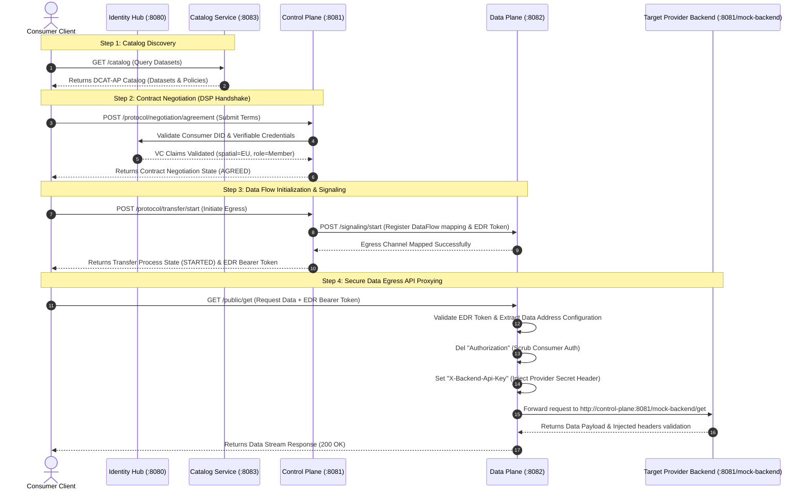

# Sovereign Dataspace Connector in Go

A production-ready, idiomatic Go monorepo implementing a custom Sovereign Dataspace Connector. This implementation mirrors the architectural principles of the **Eclipse Dataspace Components (EDC)**, enforcing strict separation of control and data planes, contract negotiation state machines, standard DCAT-AP cataloging, and decentralized identity (did:web/DCP).

---

## 1. Architectural Highlights

*   **Hexagonal Architecture**: Absolute decoupling of business models, ports (interfaces), and infrastructure adapters (HTTP, PostgreSQL, file systems).
*   **State Machine Integrity**: Contract negotiation and transfer processes follow standard, validated progression state machines that cannot be bypassed.
*   **Zero-Copy Circular Streaming**: Egress/ingress file streaming uses standard `io.Reader`/`io.Writer` streams with a strict `32KB` circular buffer to maintain constant-memory footprint.
*   **Authenticated API Proxying**: The data plane acts as a reverse proxy validation gate, scrubbing consumer-side headers and injecting backend credentials dynamically.
*   **Decentralized Identity**: Multi-tenant claims storage, a compliant outbound `did:web` HTTPS resolver, and a custom Security Token Service (STS) generating self-issued JWT keys.

---

## 2. Directory Structure

```
├── go.mod
├── docker-compose.yml
├── start.sh                   # Automation runner (build, test, deploy)
├── cmd/                       # Decoupled service binary entrypoints
│   ├── identity-hub/          # Port 8080
│   ├── control-plane/         # Port 8081
│   ├── data-plane/            # Port 8082
│   ├── catalog/               # Port 8083
│   └── data-dashboard/        # Port 8084
├── identity-hub/              # did:web, STS, VC Storage, Presentation Query API
├── catalog/                   # DCAT-AP schemas, ODRL policies, asset registries, SQL schema
├── control-plane/             # State machines, Evaluators, Outbound Signalers
├── data-plane/                # API reverse proxy, Chunked file streaming, Signaling API
├── data-dashboard/            # SSR Go HTML Template Dashboard (EDC modular layout & configuration files)
├── internal/pkg/              # Telemetry (OpenTelemetry), structured logging (slog)
└── docker/                    # Multi-stage lightweight Dockerfiles (using Go 1.26)
```

---

## 3. Sovereign Data Flow Diagrams

The sequence diagram below displays the end-to-end W3C Dataspace Protocol (DSP) handshake, signaling, and secure egress data flows executed in this connector stack:



---

## 4. Getting Started

### Prerequisites
*   **Go** version 1.26+ (baseline for Docker containers) or 1.22+ (local build)
*   **Docker** and **Docker Compose** installed locally

### Quick Start (Automated)
Run the provided bootstrap script from the project root:
```bash
./start.sh
```
This script runs the local package unit tests, validates compilation of all service binaries, cleans old container instances, and builds the stack in detached mode.

### Manual Steps
1.  **Run Tests**:
    ```bash
    go test ./...
    ```
2.  **Start Services**:
    ```bash
    docker compose up --build
    ```

---

## 5. Port Allocations & API Endpoints

Once the stack is active:

| Service | Port | Endpoint Paths | Description |
| :--- | :--- | :--- | :--- |
| **Identity Hub** | `8080` | `POST /presentations/query`<br>`POST /credentials` | Handles VC query parameters, credential ingestion, and identity verification. |
| **Control Plane** | `8081` | `POST /protocol/negotiation/request`<br>`POST /protocol/negotiation/agreement`<br>`POST /protocol/transfer/start` | Handles W3C Dataspace Protocol (DSP) handshakes and negotiations. |
| **Data Plane** | `8082` | `POST /signaling/start`<br>`POST /signaling/terminate`<br>`GET /public/*` | Performs signaling loops with the CP and acts as the reverse-proxy endpoint. |
| **Catalog** | `8083` | `GET /catalog`<br>`GET /catalog/datasets`<br>`POST /catalog/datasets`<br>`DELETE /catalog/datasets/{id}` | Standard W3C DCAT API registry for datasets, distributions, and catalog requests. |
| **Data Dashboard** | `8084` | `GET /`<br>`GET /assets`<br>`GET /catalog`<br>`GET /policies`<br>`GET /transfer` | Sovereign Node Management GUI matching Eclipse EDC DataDashboard modular views. |
| **PostgreSQL** | `5432` | — | Secure claims and catalog stores (automatically initialized with both VC and Catalog schemas). |

---

## 6. Development & Contribution Rules

All code contributions must respect the guidelines defined in [.agents/AGENTS.md](file:///.agents/AGENTS.md):
*   Domain layers must never import third-party networking, routing, or database packages.
*   Log only via standard structured `slog` using trace contexts.
*   Always run `go build ./... && go test ./...` before committing changes to check packages compilations.

---

## 7. Client Integration Testing

A client simulation utility is provided in `cmd/client-tester` to execute a full integration cycle:
1.  **Catalog Retrieval**: Downloads asset catalogs from the Catalog Service.
2.  **Contract Negotiation**: Submits negotiation request handshakes to the Control Plane.
3.  **Flow Signaling**: Simulates Control Plane to Data Plane signaling to set up proxy definitions.
4.  **Egress Retrieval**: Resolves data by passing the negotiated bearer token to the Data Plane reverse proxy, validating header injection routing to the backend (`http://control-plane:8081/mock-backend`).

To execute the integration test (ensure the Docker stack is active first):
```bash
go run cmd/client-tester/main.go
```

---

## 8. License

This repository is licensed under the **GNU General Public License v2.0 (GPL-2.0)**. See the [LICENSE](file:///home/afinana/development/projects/go-dataspace-components/LICENSE) file for the full terms and conditions.
