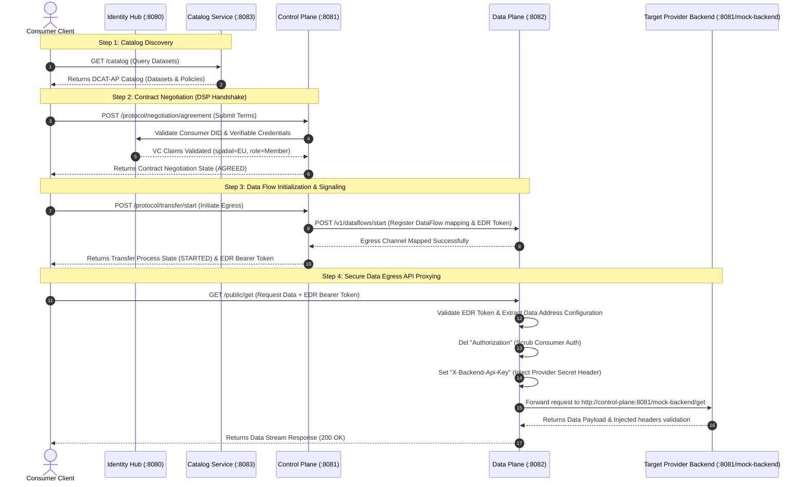

# Sovereign Dataspace Connector in Go ..

A production-ready, idiomatic Go monorepo implementing a custom Sovereign Dataspace Connector. This implementation mirrors the architectural principles of the **Eclipse Dataspace Components (EDC)**, enforcing strict separation of control and data planes, contract negotiation state machines, standard DCAT-AP cataloging, and decentralized identity (did:web/DCP).

---

## 1. Architectural Highlights

*   **Hexagonal Architecture**: Absolute decoupling of business models, ports (interfaces), and infrastructure adapters (HTTP, PostgreSQL, file systems).
*   **State Machine Integrity**: Contract negotiation and transfer processes follow standard, validated progression state machines that cannot be bypassed.
*   **Zero-Copy Circular Streaming**: Egress/ingress file streaming uses standard `io.Reader`/`io.Writer` streams with a strict `32KB` circular buffer to maintain constant-memory footprint.
*   **Authenticated API Proxying**: The data plane acts as a reverse proxy validation gate, scrubbing consumer-side headers and injecting backend credentials dynamically.
*   **Decentralized Identity**: Multi-tenant claims storage, a compliant outbound `did:web` HTTPS resolver, and a custom Security Token Service (STS) generating self-issued JWT keys.

---

## 2. Directory Structure

```
├── go.mod
├── docker-compose.yml
├── scripts/                   # Shell scripts for setup, testing, and automation
│   ├── start.sh               # Automation runner (build, test, deploy)
│   ├── test-dataspace.sh      # E2E integration test suite
│   ├── run-bruno-tests.sh     # Bruno API collection test runner
│   ├── check_coverage.sh      # Code coverage quality gate check
│   └── setup_hooks.sh         # Git pre-commit hook installer
├── cmd/                       # Decoupled service binary entrypoints
│   ├── identity-hub/          # Port 8080
│   ├── control-plane/         # Port 8081 (Provider CP)
│   ├── data-plane/            # Port 8082 (Provider DP)
│   ├── catalog/               # Port 8083
│   ├── data-dashboard/        # Port 8084
│   └── consumer/              # Port 8091 (Consumer CP)
├── identity-hub/              # did:web, STS, VC Storage, Presentation Query API
├── catalog/                   # DCAT-AP schemas, ODRL policies, asset registries, SQL schema
├── control-plane/             # State machines, Evaluators, Outbound Signalers, DSP 2025-1 Endpoints
├── data-plane/                # API reverse proxy, Chunked file streaming, Signaling API
├── consumer/                  # Consumer Control Plane, Callback Handlers, Management API & Domain
├── data-dashboard/            # SSR Go HTML Template Dashboard (EDC modular layout & configuration files)
├── internal/pkg/              # Telemetry (OpenTelemetry), structured logging (slog), JSON-LD (DSP 2025-1)
└── docker/                    # Multi-stage lightweight Dockerfiles (using Go 1.26)
```

---

## 3. Sovereign Data Flow Diagrams

The sequence diagram below displays the end-to-end W3C Dataspace Protocol (DSP) handshake, signaling, and secure egress data flows executed in this connector stack:


```mermaid
sequenceDiagram
    autonumber
    actor Consumer as Consumer Client
    participant ID as Identity Hub (:8080)
    participant Cat as Catalog Service (:8083)
    participant CP as Control Plane (:8081)
    participant DP as Data Plane (:8082)
    participant BE as Target Provider Backend (:8081/mock-backend)

    Note over Consumer, Cat: Step 1: Catalog Discovery
    Consumer->>Cat: GET /catalog (Query Datasets)
    Cat-->>Consumer: Returns DCAT-AP Catalog (Datasets & Policies)

    Note over Consumer, CP: Step 2: Contract Negotiation (DSP Handshake)
    Consumer->>CP: POST /protocol/negotiation/agreement (Submit Terms)
    CP->>ID: Validate Consumer DID & Verifiable Credentials
    ID-->>CP: VC Claims Validated (spatial=EU, role=Member)
    CP-->>Consumer: Returns Contract Negotiation State (AGREED)

    Note over Consumer, DP: Step 3: Data Flow Initialization & Signaling
    Consumer->>CP: POST /protocol/transfer/start (Initiate Egress)
    CP->>DP: POST /v1/dataflows/start (Register DataFlow mapping & EDR Token)
    DP-->>CP: Egress Channel Mapped Successfully
    CP-->>Consumer: Returns Transfer Process State (STARTED) & EDR Bearer Token

    Note over Consumer, BE: Step 4: Secure Data Egress API Proxying
    Consumer->>DP: GET /public/get (Request Data + EDR Bearer Token)
    DP->>DP: Validate EDR Token & Extract Data Address Configuration
    DP->>DP: Del "Authorization" (Scrub Consumer Auth)
    DP->>DP: Set "X-Backend-Api-Key" (Inject Provider Secret Header)
    DP->>BE: Forward request to http://control-plane:8081/mock-backend/get
    BE-->>DP: Returns Data Payload & Injected headers validation
    DP-->>Consumer: Returns Data Stream Response (200 OK)
```

---

## 4. Getting Started

### Prerequisites
*   **Go** version 1.26+ (baseline for Docker containers) or 1.22+ (local build)
*   **Docker** and **Docker Compose** installed locally

### Quick Start (Automated)
Run the provided bootstrap script from the project root:
```bash
./scripts/start.sh
```
This script runs the local package unit tests, validates compilation of all service binaries, cleans old container instances, and builds the stack in detached mode.

### Manual Steps
1.  **Run Tests**:
    ```bash
    go test ./...
    ```
2.  **Start Services**:
    ```bash
    docker compose up --build
    ```

---

## 5. Port Allocations & API Endpoints

Once the stack is active:

| Service | Port | Endpoint Paths | Description |
| :--- | :--- | :--- | :--- |
| **Identity Hub** | `8080` | `POST /presentations/query`<br>`POST /credentials`<br>`GET/POST /api/identity/v1alpha/dids`<br>`GET /api/identity/v1alpha/credentials`<br>`GET /api/identity/v1alpha/participants/{id}/credentials` | Handles VC query parameters, credential ingestion, and Identity Hub API v1alpha. |
| **Provider Control Plane** | `8081` | `POST /api/dsp/2025-1/contractnegotiations/request`<br>`POST /api/dsp/2025-1/transferprocesses/request`<br>`POST /api/dsp/2025-1/catalog/request`<br>`POST /api/mgmt/v4/catalog/request`<br>`POST /api/mgmt/v4/contractnegotiations`<br>`POST /api/mgmt/v4/transferprocesses` | Handles W3C DSP 2025-1 negotiations, provider signaling, and EDC Management API v4. |
| **Provider Data Plane** | `8082` | `POST /v1/dataflows/start`<br>`POST /v1/dataflows/{id}/terminate`<br>`GET /public/*` | Performs signaling loops with the CP and acts as the egress reverse-proxy endpoint. |
| **Catalog** | `8083` | `GET /catalog`<br>`GET /catalog/datasets`<br>`POST /catalog/datasets`<br>`DELETE /catalog/datasets/{id}` | Standard W3C DCAT API registry for datasets, distributions, and catalog requests. |
| **Data Dashboard** | `8084` | `GET /`<br>`GET /assets`<br>`GET /policies`<br>`GET /contract-definitions`<br>`GET /catalog`<br>`GET /transfers`<br>`GET /public/config/*` | Sovereign Node Management GUI matching Eclipse EDC DataDashboard modular views. |
| **NATS JetStream Console** | `8085` | `GET /` | Visual management UI for NATS JetStream message streams and event channels. |
| **Grafana Observability Dashboard** | `3000` | `GET /` | Observability GUI pre-configured with Prometheus datasource & Dataspace Executive Overview dashboard (Default credentials: `admin` / `admin`). |
| **Prometheus Metrics Collector** | `9090` | `GET /` | Metrics aggregation engine scraping `gateway:8080`, `spe-controller:2112`, `audit-worker:2113`, `web-gui:8081`, and `nats:8222`. |
| **Oxigraph Triple Store** | `7878` | `POST /update`<br>`GET /query` | Native RDF Triple Store exposing SPARQL 1.1 endpoints for DCAT-AP graph cataloging. |
| **NATS JetStream** | `4222 / 8222` | — | High-performance event stream broker for asynchronous dataspace signaling. |
| **Consumer Control Plane** | `8091` | `POST /consumer/negotiations/*`<br>`POST /consumer/transfers/*`<br>`POST /api/consumer/v4/catalog/request`<br>`POST /api/consumer/v4/contractnegotiations`<br>`POST /api/consumer/v4/transferprocesses` | Handles DSP callbacks from provider connectors and Consumer Management API v4. |
| **Consumer Data Plane** | `8092` | `POST /v1/dataflows/start`<br>`GET /public/*` | Ingress data sink / consumer proxy endpoint for provider PUSH/PULL transfers. |
| **PostgreSQL** | `5432` | — | Secure claims, catalog, and negotiation/transfer state stores for provider & consumer. |

---

## 6. Development & Contribution Rules

All code contributions must respect the guidelines defined in [.agents/AGENTS.md](file:///.agents/AGENTS.md):
*   Domain layers must never import third-party networking, routing, or database packages.
*   Log only via standard structured `slog` using trace contexts.
*   Always run `go build ./... && go test ./...` before committing changes to check packages compilations.

---

## 7. Integration & E2E Testing

Multiple test suites are provided to verify the connector stack's integrity, compatibility, and correctness:

### A. Go Unit & Package Tests
To run unit tests across all internal packages:
```bash
go test ./...
```

### B. Go E2E Consumer Service
A persistent consumer control plane service is provided in `cmd/consumer` to execute full E2E data transfer cycles locally:
1.  **Catalog Discovery**: Queries provider asset catalogs (`/api/consumer/v4/catalog/request`).
2.  **Contract Negotiation**: Initiates DSP negotiation handshakes (`/api/consumer/v4/contractnegotiations`).
3.  **Flow Signaling & Callback Handling**: Receives provider callback messages (`/consumer/negotiations/...`, `/consumer/transfers/...`).
4.  **Data Egress/Ingress**: Interacts with provider/consumer data plane endpoints.

To run the consumer service directly:
```bash
go run cmd/consumer/main.go
```

### C. Shell Integration Suite
Runs automated raw `curl` commands verifying identity querying, DCAT discovery, negotiation handshakes, data plane signaling, and proxy egress validation:
```bash
./scripts/test-dataspace.sh
```

---

## 8. Bruno API Testing & Collections

This project provides a full [Bruno](https://www.usebruno.com/) collection in the [Requests/](file:///home/afinana/development/github/go-dataspace-components/Requests) directory covering Consumer Management (`Requests/Consumer Management/`), Provider Management (`Requests/Provider Management/`), Identity Hub v1alpha specs, and Issuer Admin flows.

### Running Bruno Tests via CLI (Automated)
An orchestrator script is provided to compile, launch the containers, check for dependencies, and execute the entire Bruno integration test suite in one command:
```bash
./scripts/run-bruno-tests.sh
```
This script automatically runs the collection using the local environment and outputs a detailed execution report with a 100% pass rate.

### Using Bruno GUI
To run and inspect the requests inside the Bruno desktop application:
1.  Open the **Bruno desktop app**.
2.  Select **Open Collection** and choose the [Requests/](file:///home/afinana/development/github/go-dataspace-components/Requests) directory from this workspace.
3.  Load the **Environment**: Select the `local` environment from the environment dropdown in the top-right corner (this maps the standard environment variables to `localhost`).
4.  Run requests or use the **Collection Runner** to run all folders sequentially.

---

## 9. Architecture Decision Records (ADRs)

Design choices and architectural decisions are tracked in [docs/adr/](file:///home/afinana/development/github/go-dataspace-components/docs/adr). Key decisions include:
* [ADR-0001: Record Architecture Decisions](file:///home/afinana/development/github/go-dataspace-components/docs/adr/0001-record-architecture-decisions.md)
* [ADR-0002: Hexagonal Architecture and Package Boundaries](file:///home/afinana/development/github/go-dataspace-components/docs/adr/0002-hexagonal-architecture-and-package-boundaries.md)
* [ADR-0004: Constant Memory Data Plane Egress Streaming](file:///home/afinana/development/github/go-dataspace-components/docs/adr/0004-constant-memory-data-plane-egress-streaming.md)
* [ADR-0009: Centralized Script Organization & Path Decoupling](file:///home/afinana/development/github/go-dataspace-components/docs/adr/0009-centralized-script-organization-and-path-decoupling.md)
* [ADR-0010: Consumer-Side Architecture & DSP 2025-1 Protocol Compliance](file:///home/afinana/development/github/go-dataspace-components/docs/adr/0010-consumer-architecture-and-dsp-2025-1-upgrade.md)

---

## 10. License

This repository is licensed under the **GNU General Public License v3.0 (GPL-3.0)**. See the [LICENSE](file:///home/afinana/development/github/go-dataspace-components/LICENSE) file for the full terms and conditions.

