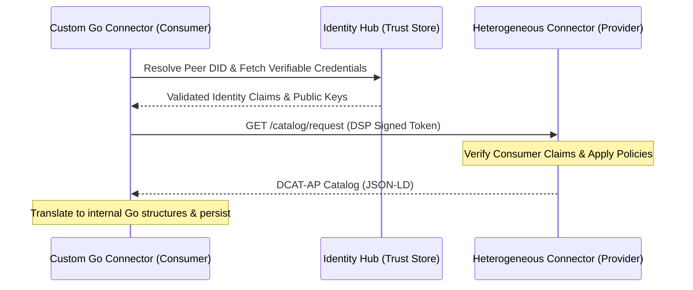

# Catalog Synchronization with External, Heterogeneous Dataspaces

To operate within a sovereign dataspace (such as Gaia-X, Catena-X, or standard International Data Spaces), this custom Go connector must interoperate with heterogeneous connectors (e.g., Eclipse Dataspace Components (EDC) in Java, Fraunhofer ISN Connectors, or custom partner nodes). 

This guide details how the connector synchronizes asset catalogs across these boundaries.

---

## 1. Core Interoperability Protocols

Dataspace catalog sharing relies on the **Dataspace Protocol (DSP)** defined by the W3C and the Eclipse Foundation, which standardizes catalog requests using:
* **Format**: JSON-LD serialization.
* **Vocabularies**: W3C DCAT (Data Catalog Vocabulary) and ODRL (Open Digital Rights Language) for usage policies.

Our Catalog component handles this through three distinct execution models:

---

## 2. Synchronization Mechanisms

### A. Pull-Based Metadata Harvesting (Crawling)
For offline or batch discovery, the connector initiates a scheduled sync worker using the internal cron/timer package.

1. **Identity Pre-flight**:
   The Catalog service asks the `/identity-hub` to resolve the Provider's Decentralized Identifier (`did:web:provider-domain`).
2. **Credential Exchange**:
   It generates a self-signed client assertion (JSON Web Token) containing its own credentials and presenting a Verifiable Presentation requested by the provider's endpoint policies.
3. **Query Dispatch**:
   It issues a `POST /protocol/catalog/request` to the target provider connector, passing query filter parameters (e.g., spatial boundaries, keywords).
4. **Ingestion & Normalization**:
   The response contains a DCAT-AP Catalog. The connector's DSP parser maps the JSON-LD structure onto the internal Go structs (`Catalog`, `Dataset`, `Distribution`) defined in `/catalog/domain/dcat.go`.

### B. Push-Based Event Streaming (Webhooks / Broker)
For near-real-time synchronization, the connector supports asynchronous push updates.

1. **Broker Registration**:
   If registering with a central metadata broker (e.g., IDSA Metadata Broker), the control plane subscribes to update notifications.
2. **Catalog Update Message**:
   When an external connector updates an asset, it sends a signed `CatalogUpdateMessage` to our Control Plane protocol endpoint:
   `POST /protocol/catalog/update`
3. **Cryptographic Validation**:
   The incoming message's digital signature is verified against the sender's public keys resolved from their DID document.
4. **Local Repository Mutation**:
   The local repository inserts or updates the dataset structure, raising internal events to notify active subscribers.

---

## 3. Translation of Heterogeneous Models

Since other connectors might use older or differing metadata vocabularies (e.g., the older IDSA Information Model vs. the new W3C DCAT-AP), the connector implements a translation layer inside the `/catalog/ports` adapters:

| External Format | Translator Adapter | Output Model |
| :--- | :--- | :--- |
| **Java EDC JSON-LD** | `edc_jsonld_transformer.go` | `domain.Dataset` |
| **IDSA InfoModel RDF** | `ids_rdf_transformer.go` | `domain.Dataset` |
| **W3C DCAT-AP (V2/V3)** | *Native JSON-LD Marshaller* | `domain.Dataset` |

### ODRL Policy Enforcement
When transforming external catalogs, ODRL policy rules are verified. If an external catalog dataset includes permissions with constraints that our Control Plane cannot automatically execute or enforce (e.g., `odrl:spatial eq "US"` when our connector is running in the `EU`), the dataset is marked as "Incompatible" and excluded from automatic synchronization to prevent violations.
